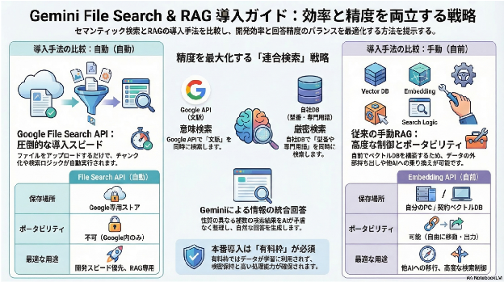

# **セマンティック検索とRAG（Gemini File Search）まとめ**

 
セマンティック検索（意味ベースの検索）をGoogleの最新ツールで実現するための、概念・作業・コスト・注意点の整理です。

## **1\. 基本概念：セマンティック検索とは**

* **仕組み:** 文章を「数値の羅列（ベクトル）」に変換し、多次元空間上の座標として配置します。  
* **メリット:** キーワードが一致していなくても、意味が近い内容（例：「PCが動かない」と「パソコンの電源が入らない」）を、地図上で距離が近いものとして探し出すことができます。  
* **RAG (Retrieval-Augmented Generation):** 検索で見つけた情報をAIに渡し、それを元に回答させる手法です。

## **2\. 作業フローの比較（手動 vs 自動）**

### **A. 従来の手動RAG（自由度が高い）**

1. **チャンク化:** 文書を300〜500文字程度に自力で分割。  
2. **エンベディング:** Embedding APIを叩いてベクトルを取得。  
3. **保存:** 外部のベクトルDB（ChromaDB, Pineconeなど）に保存。  
4. **検索:** 質問文をベクトル化し、DBから近似値を計算して抽出。

### **B. Google File Search API（圧倒的に楽）**

* **作業内容:** Google AI StudioやAPI経由で**ファイルをアップロードするだけ**。  
* **自動化される範囲:** チャンク化、エンベディング、ベクトルDBへの保存、検索ロジックのすべてをGoogle側が自動実行します。

## **3\. データの保存先とポータビリティ**

「エンベディング後のデータがどこにあるか」は、手法によって異なります。

| 項目 | File Search API (自動) | Embedding API (自前保存) |
| :---- | :---- | :---- |
| **保存場所** | Googleが管理する専用ストア | 自分のPCや契約したベクトルDB |
| **データの形式** | 非公開（ブラックボックス） | 数値リスト（JSON/NumPy等） |
| **移動・出力** | **不可**（Google内のみ） | **可能**（どこへでも移動できる） |
| **適した用途** | 開発スピード優先、RAG専用 | 他のAIへの乗り換え、高度な制御 |

## **4\. 料金プランと「無料枠」の注意点**

### **無料枠 (Free Tier)**

* **料金:** 0円（保存1GBまで）。  
* **メリット:** アップロードから検索、API呼び出しまで一気通貫で無料。  
* **代償1（プライバシー）:** 入力したデータがGoogleの**モデル改善（学習）に利用される可能性**がある。  
* **代償2（制限）:** 1分あたりの呼び出し回数（RPM）に厳しい制限がある。

### **有料枠 (Paid Tier / Pay-as-you-go)**

* **料金:** 使った分だけ（従量課金）。インデックス作成 $0.15/1Mトークンなど、極めて安価。  
* **メリット:** **データは学習に使われない**。高いRPM制限。

### **PoC（技術検証）から本番導入への流れ**

1. **検証段階（PoC）:** 公開データ（マニュアル等）を使用し、**無料枠**で「検索→回答精度」の技術検証を完結させる。  
2. **本番・機密データ段階:** 社内秘データや顧客情報を扱うタイミングで**有料枠**へ切り替え、機密保持を確保する。

## **5\. ハイブリッド検索と「並行検索」アプローチ**

近年は、キーワード検索（正確性）とセマンティック検索（柔軟性）を組み合わせた\*\*「ハイブリッド検索」\*\*が主流です。

### **Google File Search の限界**

Google File Searchは内部で自動最適化されますが、\*\*「特定の業界用語（シソーラス）の強制一致」や「メタデータ（日付、カテゴリ）による厳密なフィルタリング」\*\*を細かく調整することはできません。

### **解決策：フェデレーテッド検索（連合検索）**

アプリ側で、以下の2つを同時に走らせて結果を統合するアプローチが極めて有効です。

1. **Google File Search API:** 文書全体の「意味」を広く検索。  
2. **独自のメタデータDB (SQL/NoSQL):** 「製品ID」「特殊な業界用語の類義語展開（シソーラス）」「日付範囲」などで厳密に検索。

#### **この構成の価値**

* **特殊なシソーラス対応:** モデルが学習していない特殊な略称や社内用語を自前DB側で展開して検索できるため、検索漏れを防げます。  
* **確実性の担保:** 「エラーコード A-101」のような、ベクトル化すると意味がぼやけやすい固有名詞を、自前DBで確実にヒットさせることができます。

## **6\. Webサイトへの組み込みイメージ**

1. **準備:** Google AI Studioで「File Search Store」を作成し、ドキュメントを投入。  
2. **サーバーサイド実装:** \- ユーザーの質問に対し、**Google API** と **自前DB** の両方にクエリを投げる。  
   * 両方の結果を統合してGeminiに渡し、最終的な回答を生成。  
3. **フロントエンド:** 統合された回答を表示。

### **【コラム】なぜGeminiによる「統合」が重要なのか？**

検索結果をそのまま表示するのではなく、Gemini（AI）を介在させることには明確な理由があります。

* **データの性質の違いを吸収:**  
  * **Google File Search:** マニュアルなどの「文章の断片」が返ります。  
  * **自前DB:** 「ステータス：修理中」「期限：明日」といった「構造化データ」が返ります。  
* **「納得感」のある回答の生成:**  
  これらをGeminiに渡すことで、「マニュアルには〇〇とありますが、現在のDB上のステータスは△△ですので、××の手順を優先してください」といった、**複数の情報源を矛盾なく統合した自然な回答**をユーザーに提供できるようになります。

## **7\. まとめ：どちらを選ぶべきか**

* **「検索の専門知識はないが、高い精度で即座に導入したい」**  
  → **Google File Search API**。内部でハイブリッドに近い高度な検索が行われます。  
* **「型番や専門用語、自社独自のシソーラスを100%制御したい」**  
  → **フェデレーテッド検索（連合検索）アプローチ**。Googleの自動RAGの楽さを享受しつつ、重要なキーワード検索だけを自前DBで補完するのが、最も「良いとこ取り」な戦略です。
