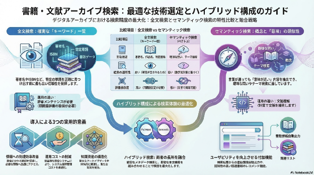
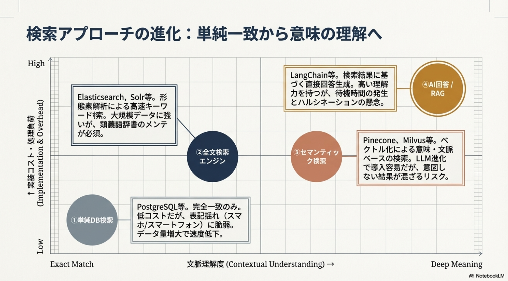

# **書籍・文献アーカイブ検索システムの技術選定に関する調査報告**

〜 検索精度の向上と運用効率化に向けた技術比較 〜

## **1\. 検索手法の比較と技術的背景**

書籍や文献のデジタルアーカイブ化において、ユーザーの検索意図（インテント）に合致した情報を抽出するための主要なアプローチを整理する。

### **実装に用いられる主な技術・サービス例**

各手法を具体的に実現する際の代表的なサービスやフレームワークは以下の通りである。

* **全文検索・DB検索**: Elasticsearch, Apache Solr, Algolia, Google Cloud Search, PostgreSQL (pgroonga等)  
* **セマンティック検索・ベクトル検索**: Pinecone, Weaviate, Milvus, OpenAI Embeddings  
* **AI回答 (RAG)・オーケストレーション**: LangChain, LlamaIndex, Google Vertex AI Search, Amazon Kendra

| 手法 | 特徴 | 課題・留意点 | 性能・運用の特性 |
| :---- | :---- | :---- | :---- |
| **① 単純DB検索** | 完全一致による抽出。低コスト。 | 表記揺れ（例：スマホとスマートフォン）に対応不可。 | データ量増大に伴うレスポンスの低下。 |
| **② 全文検索エンジン** | 形態素解析による高速なキーワード検索。 | 類義語対応には辞書のメンテナンスが必要。 | 大規模データでも安定した高速応答が可能。 |
| **③ セマンティック検索** | ベクトル化による意味・文脈ベースの検索。 | 検索意図と異なる結果が混ざる可能性。 | 近年のLLM技術により導入障壁が低下。 |
| **④ AI回答 (RAG)** | 検索結果に基づき回答を生成。 | 根拠に基づかない回答（ハルシネーション）。 | 処理のオーバーヘッドによる待機時間の発生。 |

## **2\. ハイブリッド検索アーキテクチャの検討**

特定の技術に依存せず、検索精度を最大化するためには「キーワード検索」と「セマンティック検索」を組み合わせたハイブリッド構成が有効である。

### **システム構成の構成要素**

1. **全文検索エンジン (Keyword Match):**  
   * タイトル、著者名、特定の固有名詞など、厳密な一致が求められるメタデータ検索に使用。  
2. **セマンティック検索 (Semantic Match):**  
   * 概念的な調査や、関連情報の掘り起こしなど、キーワードが曖昧な場合の本文検索に使用。  
3. **属性フィルタリング:**  
   * 発行年、カテゴリ、出版社といった構造化データによる絞り込み。

## **3\. 全文検索とセマンティック検索の特性分析**

各技術の特性に基づき、文献検索における有用性を客観的に比較する。

### **全文検索（キーワード一致）**

* **再現性と予測可能性:** 検索語が文書内に存在するか否かという明快な論理で動作するため、特定の文献を特定する際に最も高い信頼性を有する。  
* **インフラの成熟度:** アルゴリズムが確立されており、計算負荷が低く、長期的な運用においてもパフォーマンスが安定する。  
* **メンテナンス性:** 専門用語や業界用語のシソーラス（類義語辞典）を整備することで、対象分野に特化した検索精度を確実に制御できる。

### **セマンティック検索（ベクトル検索）**

* **関連情報の発見性:** 語彙が異なっても「意味が近い」コンテンツを抽出できるため、適切なキーワードが不明な初期段階の調査や、テーマに基づいた探索に適している。  
* **自然言語対応:** 文章形式のクエリに対しても適切なスコアリングが可能。  
* **ブラックボックス性:** ヒットの根拠が数学的な距離に依存するため、検索結果の妥当性について人間による解釈が困難な場合がある。

| 比較項目 | 全文検索 (キーワード一致) | セマンティック検索 (ベクトル) |
| :---- | :---- | :---- |
| **検索対象** | 特定の単語・用語の有無 | 文脈・概念の類似性 |
| **主な用途** | 著者名、作品名、ISBN、特定用語 | 曖昧な問い、テーマ検索、関連書籍提示 |
| **結果の透明性** | 高い（単語が含まれるため） | 低い（数学的計算に基づくため） |
| **辞書依存度** | 高い（同義語設定が必要） | 低い（文脈で補完可能） |

## **4\. ユーザビリティ向上に寄与する付随機能**

検索体験を最適化するための検討要素。

* **書誌情報の自動出力:** 検索結果から直接、主要な文献引用形式や書誌情報を出力する機能。  
* **関連コンテンツの自動提示:** セマンティック検索の結果を応用し、閲覧中の内容と親和性の高い他の書籍や文献をレコメンド。  
* **著作権保護の取り組み:** ブラウザからのコピー禁止制御や、右クリックの制限など、デジタルコンテンツの不正流用を防止するための技術的措置。  
* **メタデータの外部公開:** 内容紹介や概要レベルの情報を外部検索エンジンに最適化し、アーカイブの認知度を向上。

## **5\. 導入による実用的意義**

1. **情報のアクセシビリティ向上:** 確実な検索と発見的検索の双方を実現し、情報到達効率を改善。  
2. **運用の持続可能性:** 自動化技術の活用により、人的コストを抑えつつ品質を維持するフローの構築。  
3. **知識資産の構造化:** 蓄積されたデジタルデータを、横断的な検索が可能な知識ベースへと転換。